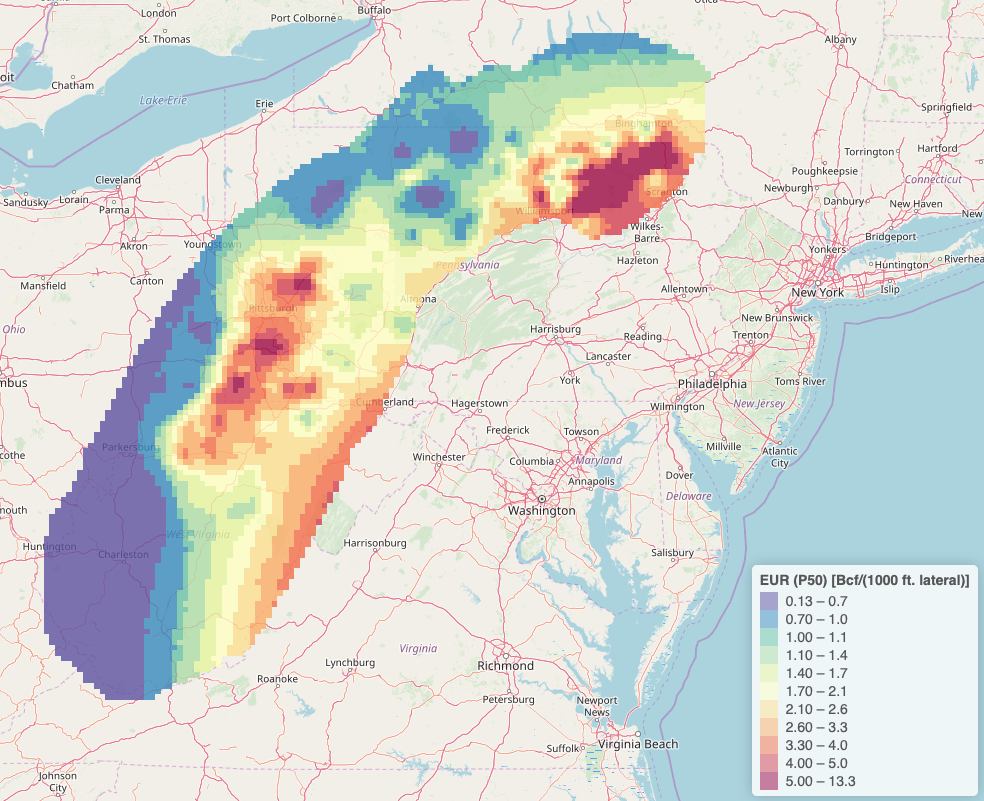

***
<div style= "float:left;position: relative; top: 0px; padding-right:10px">
```{r, echo=FALSE, out.width = "400px"}

```
</div>

[Virtual Asset 1.0](https://shinysrv.ems.psu.edu/eum19/Virtual_Asset_1_0/) R Shiny app for viewing Marcellus shale gas production data and timing of (re-)fracking events. It also allows one to interact with the research of one of my Master's students, Zhenke Xi, in which he couples decline curve analysis with geostatistics to predict EUR and production rates over the domain of the Marcellus. Details of the analysis are in [Xi and Morgan (2019)](publications\SPE-197055-PA.pdf).
